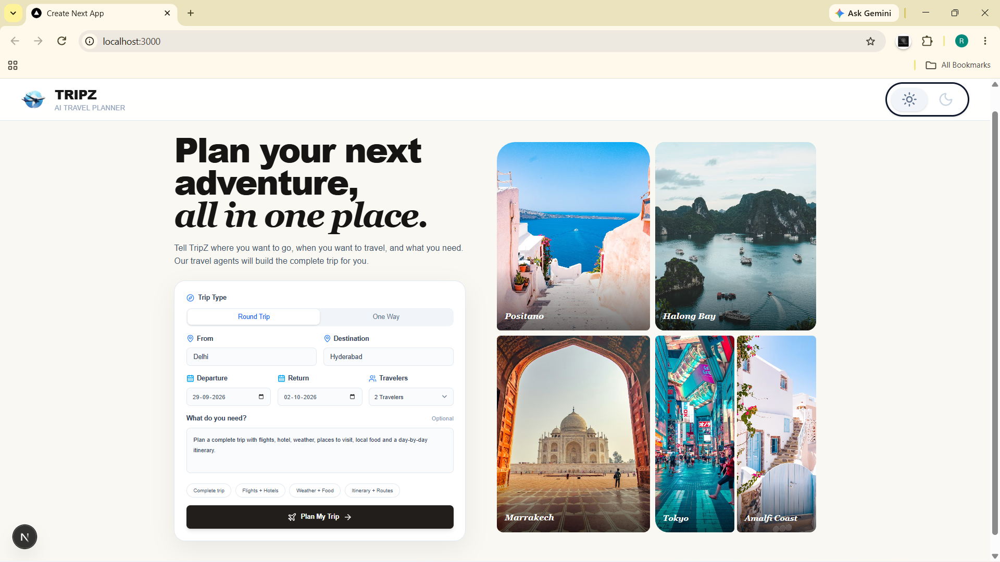

  

# ✈️ TripZ — AI Travel Planner

**1. TripZ --- AI Travel Planner ✈️**

An AI-powered multi-agent travel planning application that helps users
create a personalized trip by bringing flights, hotels, weather,
sightseeing, transportation, local experiences, itinerary planning, and
estimated expenses into one place.

**2. Overview**

TripZ combines a modern Next.js frontend with a Python/FastAPI backend
and specialized AI travel agents.

Users provide their: - Starting location - Destination - Departure and
return dates - Number of travelers - Budget - Trip type - Interests

TripZ then coordinates specialized agents and presents the results in a
unified travel dashboard.

**3.1 Key Features**

- 🧭 AI-Powered Trip Planning

- Single trip-planning interface.

- Multi-agent travel workflow.

- Consolidated travel dashboard.

**3.2 Flight Planning**

- Outbound and return flight search.

- Flight details and pricing information.

- Flight results integrated into the trip plan.

**3.3 Hotel Recommendations**

- Destination-based accommodation recommendations.

- Hotel information integrated into the trip plan.

- Accommodation costs included in estimated expenses.

**3.4 Weather**

- Destination weather information.

- Weather details available as part of the trip dashboard.

**3.5 Sightseeing & Attractions**

- Destination attraction recommendations.

- Visual attraction cards.

- Ratings, locations, descriptions, and imagery where available.

**3.6 Maps & Transportation**

- Route and location information.

- Map-based exploration.

- Transportation planning.

**3.7 Day-by-Day Itinerary**

- Day-wise travel schedule.

- Morning, Afternoon, Evening, and Overnight sections.

- Activities presented as bullet points for easy scanning.

**3.8 Local Food & Experiences**

- Destination-specific food recommendations.

- Local experiences and activities.

**3.9 Estimated Costs**

Estimated expenses are organized into: - Flights - Accommodation - Local
Transportation - Food & Dining - Activities & Attractions - Shopping &
Souvenirs

**4. Modern Frontend**

- Responsive Next.js interface.

- Separate navigation for travel sections.

- Lucide React icons.

- Travel-focused visual design.

- Light/Dark theme support.

- Loading, error, and empty states.

**5. Multi-Agent Architecture**

TripZ uses a modular agent architecture coordinated by an orchestrator.

User Trip Details
       ↓
TripZ Frontend
       ↓
AI Orchestrator
       ↓
Destination Agent
Flight Agent
Hotel Agent
Weather Agent
Maps / Transportation Agent
Sightseeing Agent
Local Food / Experiences Agent
Itinerary Agent
Expenses / Estimated Cost
       ↓
Generated Trip Dashboard

- Orchestrator: Coordinates the travel-planning workflow and manages communication
between specialized agents.

- Destination Agent: Researches the selected destination and provides destination
information.

- Flight Agent: Handles flight-search requirements and returns available flight
information.

- Hotel Agent: Finds and structures accommodation recommendations.

- Weather Agent: Provides destination weather information.

- Maps Agent: Handles routes, locations, and transportation-related information.

**6. Technology Stack**

**6.1 Frontend**

- Next.js

- React

- TypeScript

- Tailwind CSS

- Lucide React

- REST APIs / Fetch API

**6.2 Backend**

- Python

- FastAPI

- Google ADK

- Gemini / Google GenAI

- APIs & Services

- Google Maps Platform / Places API

- Google Search Grounding

- SerpAPI / Google Flights

- Weather API

- Mapping and routing services

**6.3 Development Tools**
- Git

- GitHub

- VS Code

- Python virtual environment

- npm

**7. Project Structure**

TripZ/
├── backend/
│   ├── agents/
│   ├── tools/
│   ├── orchestrator/
│   └── ...
│
├── frontend/
│   ├── app/
│   │   ├── api/
│   │   ├── components/
│   │   ├── page.tsx
│   │   └── ...
│   ├── public/
│   ├── package.json
│   └── ...
│
├── README.md
└── requirements.txt

**8. Getting Started**

Prerequisites

Node.js

npm

Python 3.x

Git

Required API credentials

Clone the repository

git clone <YOUR_TRIPZ_GITHUB_REPOSITORY_URL>
cd TripZ

Backend Setup

cd backend
python -m venv venv

Windows:

venv\Scripts\activate

Install dependencies:

pip install -r requirements.txt

Configure the required environment variables and start the backend:

uvicorn main:app --reload

Frontend Setup

Open another terminal:

cd frontend
npm install
npm run dev

Open:

http://localhost:3000

🔐 Environment Variables

Keep API keys and secrets outside the repository.

Example:

GEMINI_API_KEY=
SERPAPI_API_KEY=
GOOGLE_MAPS_API_KEY=
WEATHER_API_KEY=

Use the exact variable names required by the current implementation.

**9. Application Workflow**

- User opens TripZ.

- User enters trip details.

- User selects Plan My Trip.

- Frontend sends the request to the backend.

- The orchestrator coordinates the required agents.

- Agents gather and generate travel information.

- Results are combined into the trip state.

- The frontend displays the generated travel dashboard.

- Users navigate between individual travel sections.

**10. Performance**

TripZ response time can depend on: - Number of agents involved. -
External API latency. - AI model response time. - Sequential
vs. parallel execution. - API quota and rate limits. - Image/place
searches. - Backend processing time.

Future optimization includes increased parallel execution, caching,
request deduplication, and improved loading feedback.

**11. Known Limitations**

External APIs can have quotas and rate limits.

Separate image/place searches can create many API requests.

External API availability can affect individual agent results.

Image availability can vary by provider.

**12. Future Improvements**

- Reduce overall trip-generation latency.

- Increase parallel execution across independent agents.

- Add stronger API caching and request deduplication.

- Optimize Google Places/image usage.

- Complete the Light/Dark theme system across all pages.

- Improve mobile responsiveness.

- Enhance itinerary visualization.

- Improve map and route visualization.

- Add stronger personalization.

- Improve expense estimation accuracy.

**13. Security**

- Never commit API keys.

- Store secrets in environment variables.

- Restrict API keys to required services where possible.

- Never expose private backend credentials in frontend code.

- Validate external API responses before rendering them.

**14. License**

This project is currently maintained as a development and portfolio
application.

